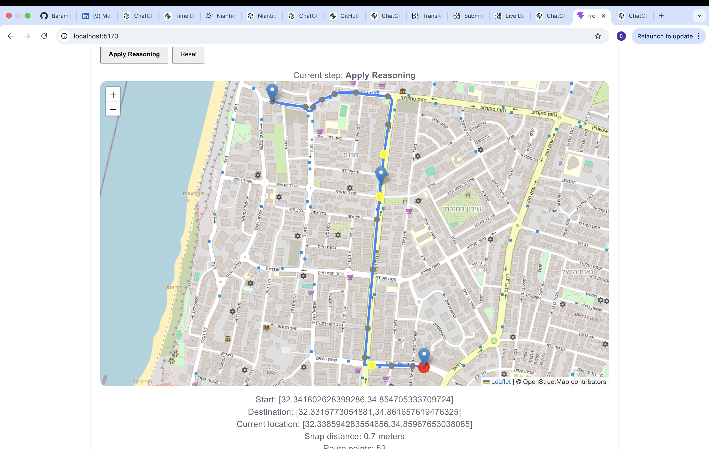
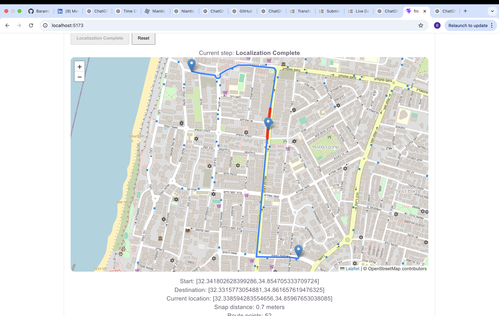

# RouteLens

Multimodal route-localization prototype using visual retrieval and LLM reasoning.

RouteLens estimates where a user is located along a known route using images instead of GPS.

## Motivation

RouteLens was designed as a backup localization system for situations where GPS becomes unreliable or unavailable.

Rather than attempting to fully replace GPS, RouteLens focuses on a more constrained problem: estimating a user’s position along a known route using visual information and multimodal reasoning.

By constraining the problem to a predefined route, the system can leverage image-based retrieval and multimodal reasoning to narrow localization to a plausible route segment.

This project explores the capabilities and limitations of combining visual retrieval and multimodal reasoning for route-level localization.

## Pipeline

1. Generate a route between a start and destination using OSRM
2. Sample points along the route every N meters
3. Extract Google Street View images for each sampled point
4. Extract images from the user/current location
5. Compute CLIP image embeddings
6. Rank route points by visual similarity
7. Use Gemini multimodal reasoning over the top candidates
8. Return the estimated route segment

## Components

### Route Generation
Uses OSRM to generate dense route geometry and sampled route points.

### Image Extraction
Downloads Google Street View imagery from multiple headings for both route points and the current location.

### Visual Retrieval
Each sampled route image and current-location image is embedded using CLIP image embeddings.

The system compares the current-location embeddings against the route embeddings to rank the most visually similar route points.

Multiple image headings are used to improve robustness against viewpoint differences and orientation changes.

### Multimodal Reasoning
The top retrieval candidates are passed to Gemini 2.5 Flash together with the corresponding route imagery and current-location imagery.

The model reasons over visual landmarks, road structure, scene layout, and spatial consistency in order to estimate the most likely route segment instead of relying purely on embedding similarity scores.

## Retrieval vs Multimodal Reasoning

The initial CLIP-based retrieval stage identifies visually similar route points, but similarity scores alone can still produce ambiguous or noisy candidates.

The multimodal reasoning stage uses Gemini 2.5 Flash to reason over the top retrieval candidates together with the current-location imagery in order to estimate a more spatially consistent route segment.

### Initial Retrieval Candidates



### Final Reasoning Result



## Tech Stack

### Frontend
- React
- Leaflet
- Vite

### Backend
- FastAPI
- Python

### AI Models
- CLIP
- Gemini 2.5 Flash

### APIs & Services
- Google Street View API
- OSRM Routing API

## Backend setup

```bash
cd backend
pip install -r requirements.txt
export GOOGLE_API_KEY="YOUR_KEY_HERE"
export GEMINI_API_KEY="YOUR_KEY_HERE"
uvicorn main:app --reload
```

Requires:
- Google Street View API access
- Gemini API key

Backend runs at:

```text
http://127.0.0.1:8000
```

## Frontend setup

```bash
cd frontend
npm install
npm run dev
```

Frontend runs at:

```text
http://localhost:5173
```

## Current Limitations

- Current demo uses Street View imagery for both route and user location
- Performance can degrade in visually repetitive areas
- Retrieval rankings are still somewhat noisy
- System currently assumes a known route