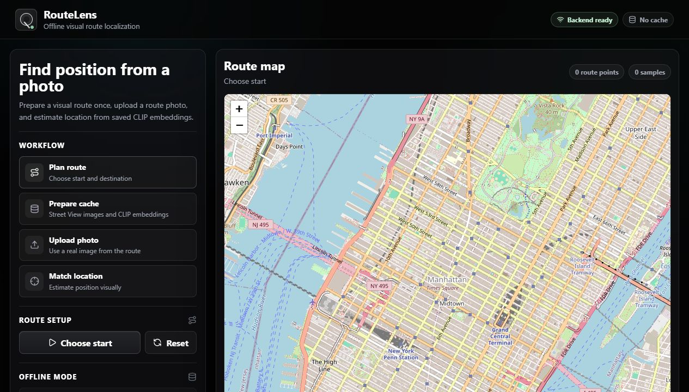

# RouteLens

RouteLens is a visual route-localization prototype that estimates where a user is along a known route using imagery instead of GPS.

This branch, `experimental-offline-mode-UI`, extends the original RouteLens prototype with an experimental offline-cache workflow and a redesigned user interface for clearer demos.



## What This Branch Adds

### Experimental Offline Mode

The offline-mode work explores a cache-based version of RouteLens:

1. Generate a route between a start point and destination.
2. Sample points along that route.
3. Download Google Street View images for the sampled points.
4. Compute CLIP embeddings for those route images.
5. Save the route images, metadata, and embeddings locally.
6. Let the user upload a photo.
7. Embed the uploaded photo with CLIP.
8. Compare the uploaded-photo embedding against the saved route embeddings.
9. Show the most visually similar route locations with a confidence score.

The goal is to support localization on a previously prepared route without making new Street View or Gemini calls during matching.

Important: preparing the cache still requires Google Street View access. The offline part refers to the matching step after a route cache already exists.

### UI Redesign

This branch also redesigns the frontend around the user journey:

- Plan route
- Prepare cache
- Upload photo
- Match location
- View confidence and top visual matches

The interface uses a dark glass-style layout with:

- a persistent status/header bar
- a guided workflow panel
- a larger route map
- photo evidence previews
- top visual match results
- clearer route/cache/upload states

## Core Pipeline

The original online RouteLens pipeline is:

1. Use OSRM to generate a driving route between start and destination.
2. Sample route points every fixed number of meters.
3. Download Google Street View imagery for each sampled route point.
4. Download Street View imagery for the user's/current location.
5. Use CLIP to convert each image into a normalized embedding vector.
6. Compare current-location embeddings against route-image embeddings using cosine similarity.
7. Rank route points by visual similarity.
8. Send the top candidates to Gemini 2.5 Flash for multimodal reasoning.
9. Return the most likely route segment.

## How Image Matching Works

RouteLens uses CLIP image embeddings for visual retrieval.

For each route point, the backend downloads multiple Street View headings such as forward, right, backward, and left. Each image is embedded with CLIP and normalized.

For the query/current-location imagery, the backend also computes CLIP embeddings. It then compares each query embedding with each route image embedding using a dot product between normalized vectors, which is equivalent to cosine similarity.

The ranking logic groups scores by route index:

- each route image is compared with the available query images
- the best query match for that route image is kept
- each route point receives a combined similarity score from its strongest views
- route points are sorted by similarity
- the top candidates are shown on the map and can be passed to Gemini

This gives the system a fast visual retrieval stage before the more expensive multimodal reasoning stage.

## Gemini Reasoning

CLIP retrieval can find visually similar candidates, but it may confuse repetitive urban areas, similar intersections, or visually similar road segments.

Gemini is used as a second-stage reasoning model. It receives:

- the dense route geometry
- the top CLIP retrieval candidates
- candidate Street View images
- current-location images
- similarity scores and route metadata

Gemini then reasons over landmarks, road layout, building placement, lane direction, sidewalks, vegetation, signs, and spatial consistency to estimate a likely route segment.

## Tech Stack

### Frontend

- React
- Vite
- Leaflet
- Lucide icons

### Backend

- FastAPI
- Python
- PyTorch
- Transformers
- Pillow

### Models

- CLIP for image embeddings and visual retrieval
- Gemini 2.5 Flash for multimodal reasoning

### APIs

- OSRM Routing API
- Google Street View Static API
- Gemini API

## Backend Setup

```bash
cd backend
pip install -r requirements.txt
export GOOGLE_API_KEY="YOUR_STREET_VIEW_KEY"
export GEMINI_API_KEY="YOUR_GEMINI_KEY"
uvicorn main:app --reload
```

On Windows PowerShell:

```powershell
cd backend
$env:GOOGLE_API_KEY="YOUR_STREET_VIEW_KEY"
$env:GEMINI_API_KEY="YOUR_GEMINI_KEY"
.\.venv\Scripts\python.exe -m uvicorn main:app --reload
```

Backend runs at:

```text
http://127.0.0.1:8000
```

## Frontend Setup

```bash
cd frontend
npm install
npm run dev
```

Frontend usually runs at:

```text
http://127.0.0.1:5173
```

If that port is busy, Vite may use the next available port.

## Current Limitations

- Street View cache preparation still requires a valid Google Street View Static API key.
- Gemini reasoning requires a Gemini API key.
- Offline matching depends on a local CLIP model and cached route embeddings.
- The offline workflow is experimental and should be validated before using it as the primary demo path.
- The system assumes the user is somewhere along a known route.
- Repetitive streets and visually similar intersections can reduce retrieval confidence.
